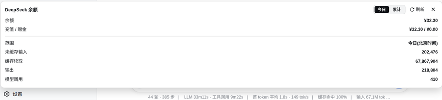

# dsh-balance-plugin

[](https://awesome-dsh-plugin.com)

A DeepSeek Harness (dsh) web plugin: shows **DeepSeek API balance** and **token usage** at the bottom of the web sidebar (port 3080), with a **Today / All-time** toggle, filtered by provider (only `deepseek-official`, ignoring other vendors).

## Features

- 💰 Balance: calls DeepSeek's official `GET /user/balance`, reusing dsh's credentials (`~/.dsh/.credentials.yaml`) — no manual key entry
- 📊 Token usage: reads dsh session logs (`session.jsonl.zstd`), aggregates by provider
  - Uncached input / cache read / output / model call count
- 🔄 Today / All-time toggle: today (Beijing time) or full history
- 🎨 Auto-adapts to light/dark theme + refresh button + close button

## Screenshot



## Install (from the plugin market)

```sh
dsh plugin --profile web add dsh-balance-plugin
```

Restart `dsh web`, then refresh the page — a balance button appears at the bottom of the sidebar.

## Architecture

```
Browser (3080 page)
  client.js ──fetch──▶ /dsh-balance/data?scope=today|all
                              │
node side (index.js, inside the dsh process)
  ├── credentials.resolve("DEEPSEEK_API_KEY")  ← reuses dsh's key
  ├── fetch(https://api.deepseek.com/user/balance)
  └── decompress ~/.dsh/sessions/*/*/session.jsonl.zstd
      filter assistant/message rows + provider=deepseek-official
```

- `index.js`: node-side cordis plugin, registers HTTP route `/dsh-balance/data`
- `client.js`: browser-side plugin, injects into `sidebar.footer.action` (sidebar bottom button + floating panel)
- `package.json`: `dsh.bundle` + `dsh.client.platform: "web"` + `exports["./client"]`
- `cordis.patch.yml`: bundle patch registering the node entry

## Manual install

```sh
mkdir -p ~/.dsh/profiles/web/node_modules/dsh-balance-plugin
cp index.js client.js cordis.patch.yml package.json ~/.dsh/profiles/web/node_modules/dsh-balance-plugin/
```

Then add to `~/.dsh/profiles/web/cordis.patch.yml`:

```yaml
- insert:
    - id: dsh-balance
      name: dsh-balance-plugin
```

Restart `dsh web` and refresh the browser.

## Dependencies

- node side: Node built-ins only (`node:fs`, `node:child_process`, `node:path`); requires the `zstd` CLI for decompressing session logs
- browser side: `@deepseek-ai/dsh-client-ui-primitives` (peer dep, ships with dsh 0.1.0-rc.6)

## Data source

Session logs at `~/.dsh/sessions/<scope>/<session-id>/session.jsonl.zstd`. Each `assistant/message` row:

```json
{
  "type": "assistant/message",
  "time": 1786635270943,
  "data": {
    "message": { "source": { "kind": "model", "provider": "deepseek-official", "model": "deepseek-v4-pro" } },
    "usage": { "inputTokens": 8702, "outputTokens": 298, "cacheReadTokens": 0 }
  }
}
```

## Pack

```sh
npm pack   # produces dsh-balance-plugin-0.1.0.tgz
```

## License

MIT
